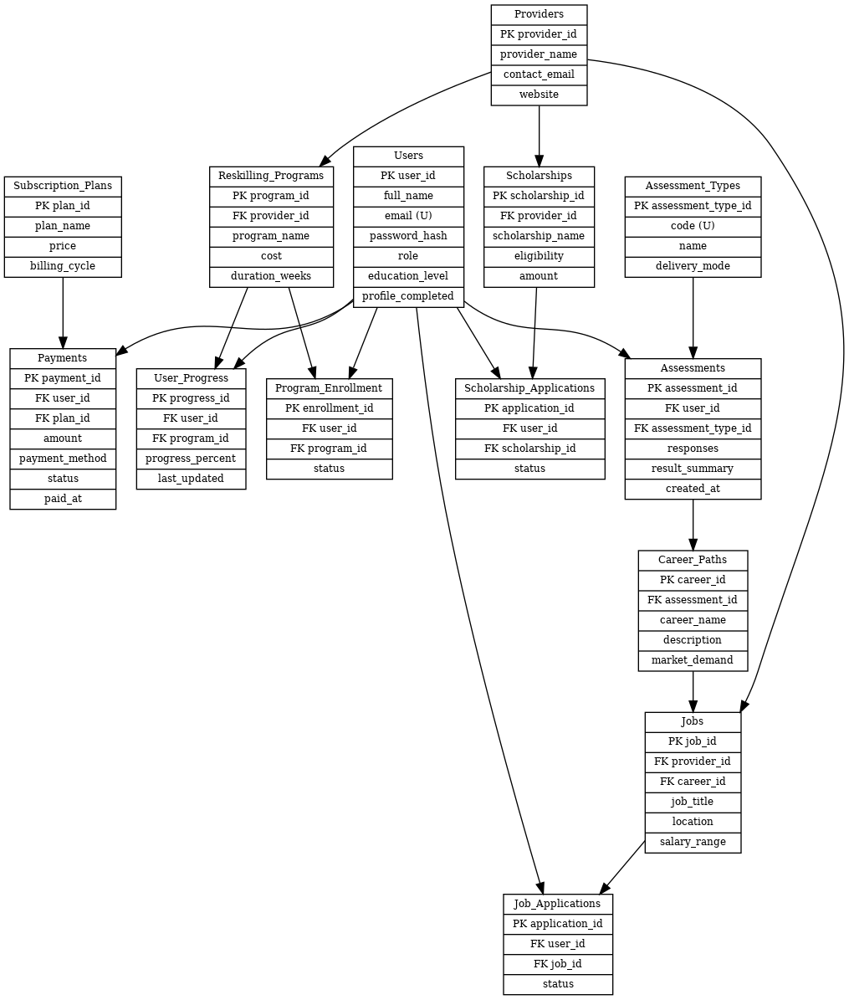

#### PLP-Database-Design-Week_8_Assignment_Final_Project

# 📋 Career Pathway & Reskilling Platform — Database Design Summary

## 🎯 Project Objective
Design and implement a relational database management system (DBMS) in MySQL for a real-world platform that guides graduates in career pathways, reskilling, and scholarship/job opportunities.

## 📂 Database Schema Overview
**Database Name:** `career_platform`

### Core Tables (Entities)
- **Users** – student, admin, and provider accounts.  
- **Subscription_Plans** – freemium/premium plan definitions.  
- **Payments** – records user subscription transactions.  
- **Assessment_Types** – aptitude, skills, interest, behavioral, technical.  
- **Assessments** – results per user and assessment type.  
- **Career_Paths** – recommended career paths linked to assessments.  
- **Providers** – external institutions providing programs, jobs, scholarships.  
- **Reskilling_Programs** – training programs from providers.  
- **Program_Enrollment** – junction table tracking user enrollments.  
- **Scholarships** – scholarships from providers.  
- **Scholarship_Applications** – junction table linking users to scholarships.  
- **Jobs** – job postings from providers.  
- **Job_Applications** – junction table linking users to jobs.  
- **User_Progress** – user’s learning/program progress.  
- **Audit_Logs (optional)** – records admin/test actions.  

## 🔗 Relationships
### One-to-Many
- `Users → Payments, Assessments, Job_Applications, Scholarship_Applications`  
- `Providers → Jobs, Programs, Scholarships`  

### Many-to-Many
- `Users ↔ Scholarships` via `Scholarship_Applications`  
- `Users ↔ Jobs` via `Job_Applications`  
- `Users ↔ Programs` via `Program_Enrollment`  

### One-to-One (logical)
- Each `User` has one profile (`Users`).  

## ⚙️ Constraints Implemented
- **Primary Keys:** Auto-increment integer IDs for all major entities.  
- **Foreign Keys:** Enforced across all relationships with cascading rules.  
- **NOT NULL:** On required attributes (`email`, `full_name`, `password_hash`, etc.).  
- **UNIQUE:** On `Users.email`, `Assessment_Types.code`.  
- **CHECK Constraints/Triggers:**  
  - High school students **cannot apply** for scholarships, jobs, or reskilling programs.  
  - Enforced with MySQL **triggers** at the database level.  

## 🧪 Testing Strategy
- Used a **test database copy** (`career_platform_test`).  
- Inserted sample users (admin, high school student, college graduate).  
- Verified triggers block invalid applications.  
- Confirmed allowed inserts (college graduate + admin) succeed.  

## 📦 Deliverable
A single `.sql` file, [Career Platform DBMS](Career_Platform_Schema_DBMS.sql), containing:  
- `CREATE DATABASE` and `USE` statements.  
- `CREATE TABLE` statements with PK/FK/constraints.  
- Trigger definitions enforcing business rules.  
- *(Optional)* reset/test script kept separately for testing only.  

## 🗂️ Entity-Relationship Diagram (ERD)

The following ERD illustrates the database schema, showing tables, columns, and their relationships:

### 🔎 ERD Explanation

- **Users** form the core of the system, storing all student and admin accounts.  
- **Assessments** are linked to each user and assessment type, producing results that generate **Career_Paths**.  
- **Providers** (institutions, employers, organizations) offer **Reskilling_Programs**, **Scholarships**, and **Jobs**.  
- **Users** interact with these opportunities through junction tables:  
  - **Program_Enrollment** (for reskilling)  
  - **Scholarship_Applications** (for scholarships)  
  - **Job_Applications** (for jobs)  
- **Payments** track subscriptions to **Subscription_Plans**, enabling freemium/premium access.  
- **User_Progress** monitors individual learning progress in programs.  

This design ensures a clear flow:  
👉 Students take **assessments → get career recommendations → access reskilling programs, scholarships, and jobs**.  

## 🛠️ Tools Used

- **MySQL Database** – Core relational database system for schema design and implementation.  
- **MySQL Workbench** – For ERD modeling, database visualization, and query testing.  
- **VS Code** – Code editor for writing and managing SQL scripts.  
- **Git & Git Bash** – Version control and command-line interface for managing commits.  

----

✅ **Conclusion:**  
This database design is **well-structured, normalized, and enforces business rules** through foreign keys and triggers. It is ready for integration into the Career Pathway & Reskilling web platform.

